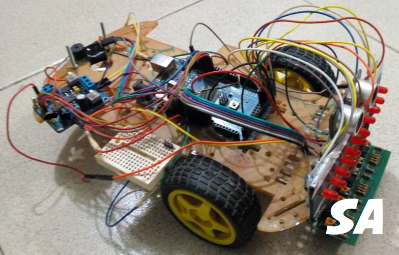

<h3>Overview</h3>
The basic function of this line follower robot is to travel through a path designed using black lines.
 The robot has the capability to travel through both straight and curved lines, as well as take corner turns.
 It also has the capability to travel through caves as well as avoid obstacles.
 Additional functions include sound generation upon taking turns, 
 series of LED lights at the front of the robot and displaying
 presence/absence of line follower robot inside cave using LCD.
  
 
 <figure>
 
 
 <figcaption>Fig. - Line Follower Robot.</figcaption> 

</figure>
 <h4>AUST 3.2 MSD LAB Final Project By</h4>
<ul style="list-style-type:square">
  <li>SAGOR AHAMED</li>
<li>NABIL AHMED</li>
<li>Shanjoy Paul Shuvo</li>
</ul>
<h4>FEATURES:</h4>
<ul style="list-style-type:circle">
 <li>Movement by line following</li>
<li>Obstacle avoiding</li>
<li>Moving through cave</li>
<li>Detection of presence of LFR in cave using laser and LDR sensor and displaying the result in LCD</li>
<li>Generating sound upon detection of line</li>
<li>Knight rider-like LED effect</li>
<li>Illumination of cave upon entry of LFR into cave</li>
</ul>

<h4>Parts List:</h4>
<ul style="list-style-type:circle">
<li>Robot Car Chassis</li>

<li>Arduino Mega 2560 Rev3 & Arduino Uno</li>

<li>L293D Dual DC Motor Controller</li>

<li>Digital IR Sensor Array6B (TCRT5000)</li>

<li>Battery Packs Lithium Ion Battery</li>

<li>Ball Caster</li>

<li>Jumper Wires</li>

<li>Buzzer</li>

<li>Custom Red LEDs Array</li>

<li>Ultrasonic HC-SR04 Sensor</li>

<li> Lipo Battery 1800mah 25C</li>

<li>White LEDs Array</li>

<li>LCD Display (16X2)</li>

<li>LDR</li>

<li>Laser Diode 5V</li>

<li>Gear motor & wheel</li>

<li>Ball Caster</li>
</ul>

<h2>Demo Video</h2>
<h5>Link:https://www.youtube.com/embed/eg_g9NB7TA0</h5>
<h3>If You Like Please Subscribe To My Youtube Channel</h3>
<h5>Link: https://www.youtube.com/channel/UCiOisebyFCDWSFaabAyvZeg</h5>

<figure>
 
 
 <figcaption>Fig. - LFR Circuit Diagram.</figcaption> 

</figure>

<figure>
 
 
 <figcaption>Fig. - Cave Circuit Diagram.</figcaption> 

</figure>
